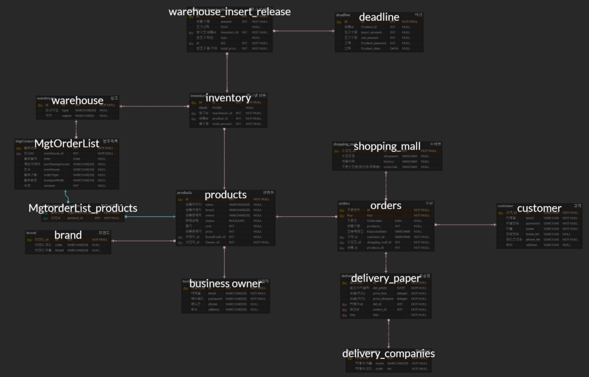
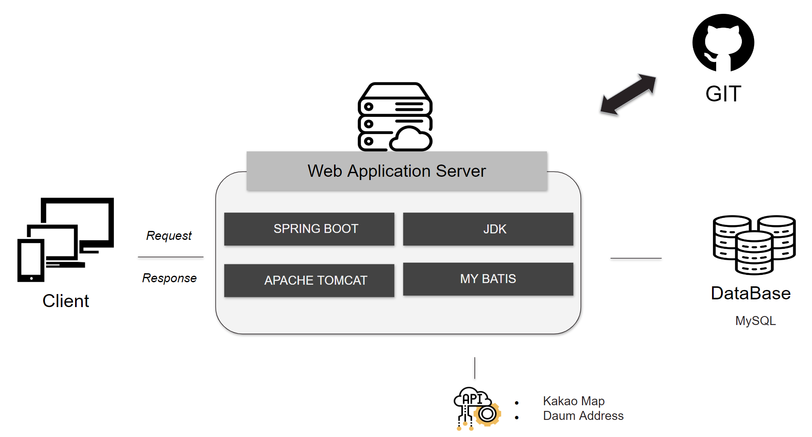
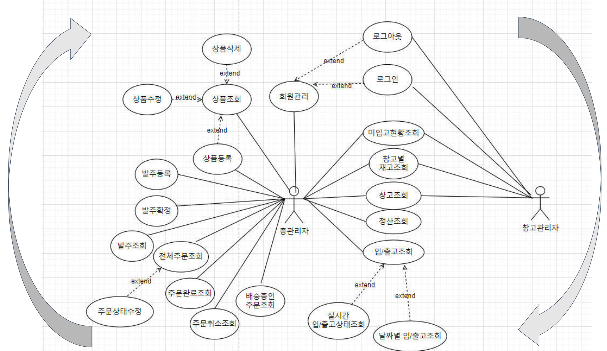
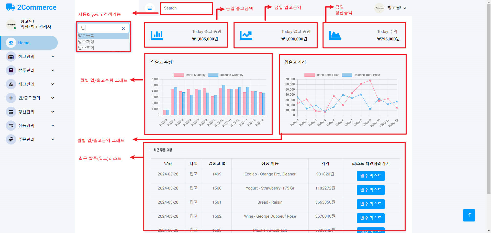
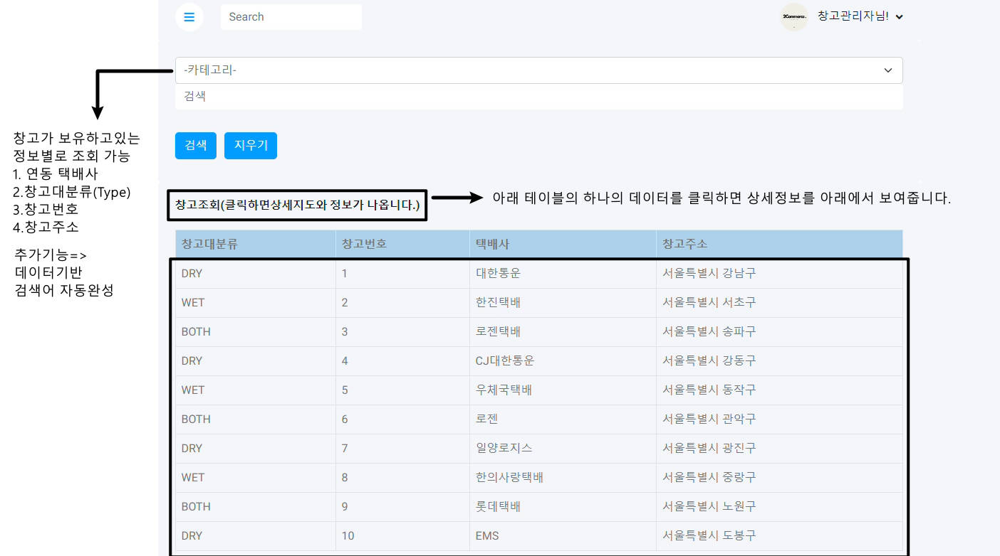
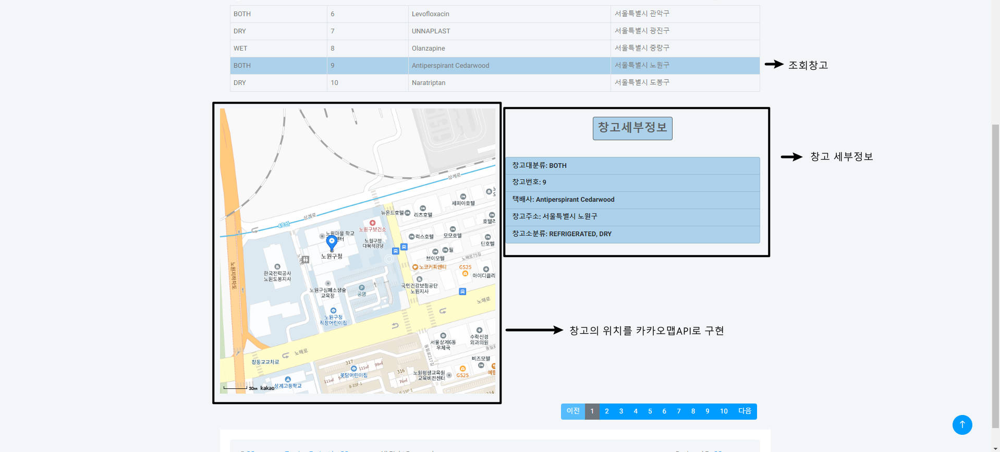

<h1>쇼핑몰 통합관리 시스템</h1>

### 프로젝트 주제 
- 상품에 대한발주 및 주문상태에 따라 실시간 창고 입/출고 및 재고상황을 효과적으로 관리하기 위해 창고의 물류 흐름을 데이터로 수치화하고 가시화하여 실시간으로 창고운영상황을 파악하고 최적화할 수 있는 시스템을 구축한다.
- 상품의 유통과정에 대해서 한눈에 파악이 가능하도록 구현한다.

---

### 프로젝트 목적 

- 쇼핑몰관리자, 창고관리자, 총관리자가 있다.
- 상품에 대한 주문상태를 변경할 수 있다. (주문은 쇼핑몰이용객의 상품 주문으로 이루어진다.)
- 상품에 대한 발주신청을 할 수 있고 발주상태를 변경 할 수 있다.
- 창고관리자는 재고관리, 입출고관리를 할 수 있다.
- 각 상품에 대한 상태는 발주 대기,취소,확정 / 주문 대기,취소,확정에 따라
    입/출고상태도 입/출고 대기,취소,확정으로 실시간 조회처리를 한다.
- 총관리자는 모든 기능을 다 사용할 수 있다.

---

### 주요기술 

| 기술 | 설명 |
| --- | --- |
| **Spring Boot** | 생산성 향상을 통해 빠르고 효율적인 웹 애플리케이션 개발 구현 |
| **MyBatis** | SQL 매핑을 통해 복잡한 쿼리를 효율적으로 관리하며 DB 연동을 단순화 |
| **Thymeleaf** | HTML 템플릿 엔진을 사용하여 서버 사이드에서 동적인 웹페이지를 손쉽게 랜더링 |
| **OPEN-API** | DAUM 주소검색, kakao Map |
| **Spring Security** | 인증 및 인가를 효율적으로 관리하기 위한 라이브러리 |
| **Bootstrap** | 반응형 웹 디자인을 쉽게 구현하기 위한 프론트엔드 프레임워크 |
| **AJAX** | 비동기식 자바스크립트와 XML을 사용하여 페이지를 새로 고침하지 않고 서버와 통신 |
| **JPA** | 자바 객체와 데이터베이스 테이블 간의 매핑을 관리하는 자바 표준 ORM |

---

<h3>팀원 소개</h3>

| 이름 |                                                                      업무 |
| --- | --- |
| 양성준  | 전체 코드 구조 관리 및 개발, ERD 설계, Back-end 개발환경 구성  |
| 최문석  | Front-end개발환경 구성, 창고관리, 홈화면-dashboard, 입/출고관리, 재고관리  |
| 백정훈 | 발주관리, 문서작업 및 발표 PPT 작성  |
| 문지환 | 상품관리 |
| 이도엽 | 주문관리 |
| 임태환 | 회원관리 |
| 이다혜 | 상품관리,정산관리 |

---

###  사용한 기술 스택

#### 백엔드

#### 프론트엔드

#### 서버

#### 툴

---

### ERD

---
### 구조도

---
### 유즈케이스

---
### 시연영상 
[클릭하시면 유투브 시연영상 보실 수 있습니다.](https://www.youtube.com/watch?v=VFlLRDUYnwE)

---

### 맡은파트구현 Page

--- 

- 데쉬보드를 작성하면서 가장 합리적인 로직을 구현하려고 노력했고, 가장 적합한 데이터가 무엇이 있을지를 파악하고 그것을 HomePage에 구현하였습니다.

- Model 객체를 이용하여 data를 나눴습니다.
---

- Click 이벤트가 발생하였을때 상세페이지와 kakaoMap API를 이용한 지도를 표현하도록 구현하였습니다.

---

<h3>회고</h3>
**[트리거사용]**

재고의 상태를 변경하는데 트리거를 적용해서 사용해보는 경험이 저에게 되게 도움이 많이 되었고 

트리거를 제대로 사용하려면 모든 테이블, 프로젝트의 로직을 다 알고있어야 한다는것을 알게되었습니다. 단순하게 제가 구현한 기능에서 멈추지 않고 정확히 언제 테이블에 데이터가 변경이 되고 그 시점을 파악을 하고 그때 트리거를 적용을 시켜서 데이터가 변화하는것을 직접 눈으로 확인을 해보니 트리거를 왜 사용하고 왜 효율적인지를 알게되는 계기가 되었습니다. 

**[부트스트랩]**

프론트를 더 효율적으로 구현하기 위해 부트스트랩을 처음 사용해 보았는데 처음에는 어려움이 있었지만 어느정도 코드를 보면서 부트스트랩 프레임워크를 익히다 보니 익숙해졌고 제가 직접 부트스트랩 템플릿을 가져와서 팀원들에게 나눠주다 보니 설명을 해줘야 하는 입장이였습니다. 

그래서 더 섬세히 공부를 하게되는 계기가 되어 좋았습니다. 또한, 템플릿을 가져오는 과정에서도 어떠한 템플릿이 좀 더 사용자 친화적으로 구현이 될지를 고민을 하지 않을 수 없었습니다. 저의 업무를 하는데 있어서 발휘되는 꼼꼼함과 세심함이 개발을 하는데 도움이 많이 되었습니다.

**[Spring사용 + Front 적용]**

기존의 CLI 방식에서 코드를 한 줄 한 줄 디테일하게 작성하면서 공부했던게 많은 도움이 되었습니다. Spring Boot를 적용한 프로젝트를 처음 하다보니 익숙하지 않아 어려움이 좀 있었지만 

한 줄 한줄 쿼리문을 작성하고, CRUD에서 불필요한 코드는 없는지 체크하면서 진행 하다보니 재미가 붙었고 1차에서 만들어 놓은 코드들을 리펙토링 하다보니 프론트에서 오히려 시간을 많이 사용했습니다.

